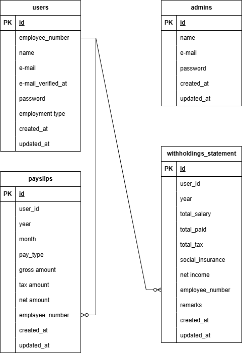
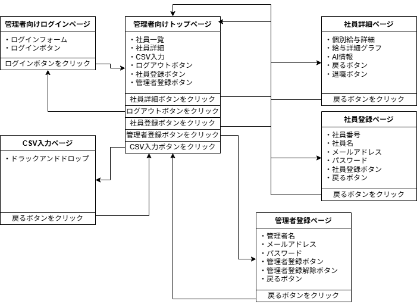
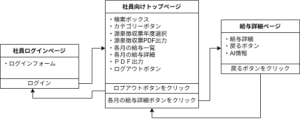
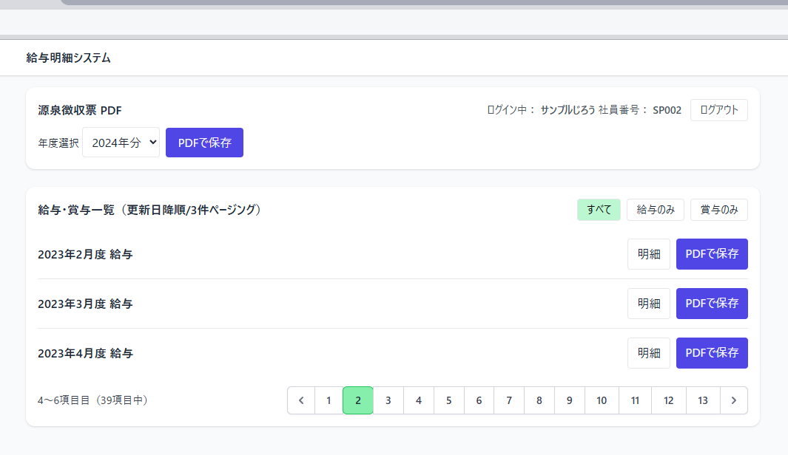
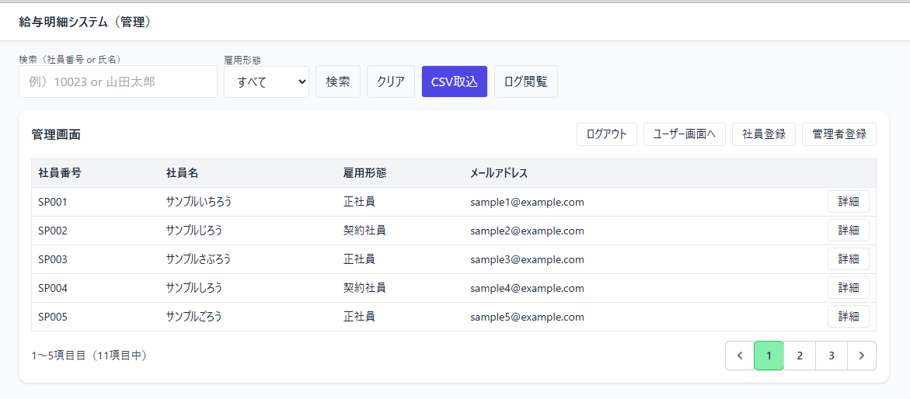
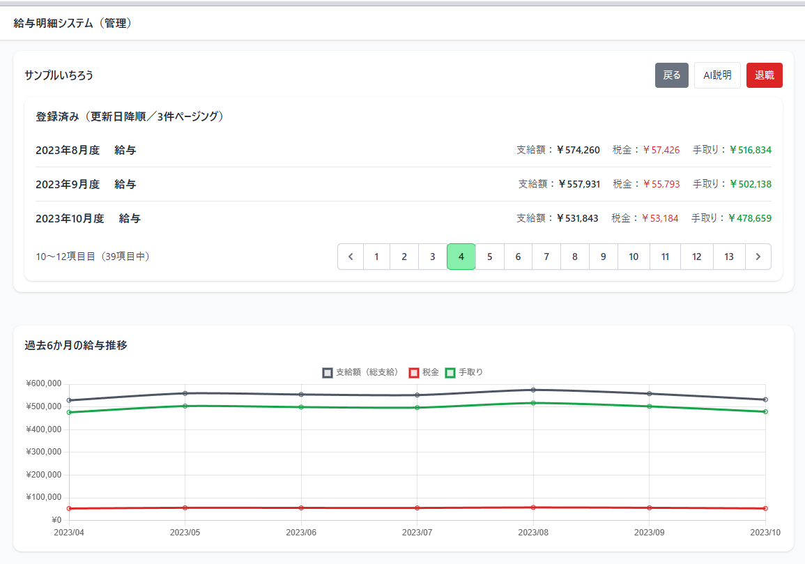

# Payroll App

給与明細アプリ（Laravel 12 / PHP 8.2）。このリポジトリはデモ用ポートフォリオです。

## 概要
- 管理者（admin）と一般ユーザー（web）のガード分離
- 支払明細（Payslip）と源泉徴収票の作成・ダウンロード（PDF）
- 検索・ページング・チャート向けデータ整形

## 主要技術
- PHP 8.2, Laravel 12
- Vite, TailwindCSS（フロントエンド資産）
- barryvdh/laravel-dompdf（PDF 出力）
- PHPUnit を用いたテスト（in-memory sqlite 設定）

---

## 必須環境（開発用 / Windows PowerShell）
- PHP 8.2
- Composer
- Node.js + npm
- SQLite または MySQL（サンプル手順は SQLite を前提）

---

## 速攻セットアップ（PowerShell）
プロジェクトルートで以下を実行してください。

```powershell
# 依存インストール
composer install
npm install

# 環境ファイル作成
copy .env.example .env
php artisan key:generate

# sqlite を使う場合（database/database.sqlite ファイル作成）
if (-Not (Test-Path database\database.sqlite)) { New-Item database\database.sqlite -ItemType File }

# マイグレーション & シーダ（開発用）
php artisan migrate --seed

# ビルド（開発ビルド）
npm run build

# ローカルサーバ起動
php artisan serve
```

ブラウザで http://127.0.0.1:8000 を開きます。

---

## サンプルアカウント
（デフォルトで seed が用意されている場合）
- 管理者: admin@example.com / password / ログインアドレス:/admin/login
- ユーザ: sample4@example.com / password / ログインアドレス:/login

※ もしシーダがない場合は、`php artisan tinker` で手動作成してください。

---

## テスト
ローカルでテストを実行するには：

```powershell
php artisan test
```

テストは `phpunit.xml` で `:memory:` SQLite を使う設定になっています。

---

## よくある問題と対処
- 「Trait Tests\\CreatesApplication not found」などのエラーが出る場合は、`tests/CreatesApplication.php` が存在することを確認してください。
- 依存関係エラーは `composer install` を再実行してキャッシュをクリアしてください。
---

## アーキテクチャ概要

このアプリケーションの全体構成とデータ設計は以下の通りです。

### ER 図
<p align="center">
  
</p>
ER 図は、給与明細（payslips）、ユーザー（users）、源泉徴収票（withholding_statements）などの関連を示しています。

### 状態遷移図（管理者側）
<p align="center">
  
</p>
管理者は「ログイン → 社員一覧閲覧 → 明細作成 → PDF 出力」などのフローを持ちます。

### 状態遷移図（社員側）
<p align="center">
  
</p>
社員ユーザーは「ログイン → 明細確認 → PDF ダウンロード」などのシンプルなフローです。

---

## Screenshots

以下はアプリケーションのスクリーンショット例です。<br>
給与リスト画面
<p align="center">
	
</p>
管理者用社員リスト画面
<p align="center">
	
</p>
管理者用社員詳細画面
<p align="center">
	
</p>

---
### Premium Partners

- **[Vehikl](https://vehikl.com)**
- **[Tighten Co.](https://tighten.co)**
- **[Kirschbaum Development Group](https://kirschbaumdevelopment.com)**
- **[64 Robots](https://64robots.com)**
- **[Curotec](https://www.curotec.com/services/technologies/laravel)**
- **[DevSquad](https://devsquad.com/hire-laravel-developers)**
- **[Redberry](https://redberry.international/laravel-development)**
- **[Active Logic](https://activelogic.com)**

## Contributing

Thank you for considering contributing to the Laravel framework! The contribution guide can be found in the [Laravel documentation](https://laravel.com/docs/contributions).

## Code of Conduct

In order to ensure that the Laravel community is welcoming to all, please review and abide by the [Code of Conduct](https://laravel.com/docs/contributions#code-of-conduct).

## Security Vulnerabilities

If you discover a security vulnerability within Laravel, please send an e-mail to Taylor Otwell via [taylor@laravel.com](mailto:taylor@laravel.com). All security vulnerabilities will be promptly addressed.

## License

The Laravel framework is open-sourced software licensed under the [MIT license](https://opensource.org/licenses/MIT).
